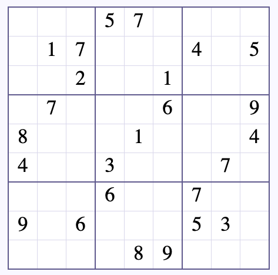
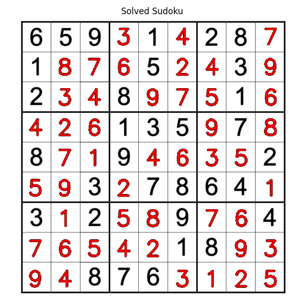
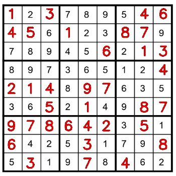

# SudoVisionCruncher

## Summary

## Requirements

* [uv](https://docs.astral.sh/uv/)
* Python 3.11.15
* [Tensorflow](https://www.tensorflow.org/) 2.18.0
* [Metal](https://developer.apple.com/metal/tensorflow-plugin/) 1.2.0 (for Mac Silicon)

## Instructions

Download Python with **uv**:

```zsh
uv venv --python 3.11.15
```

Activate the environment:

```zsh
source .venv/bin/activate
```

Install the packages:

```zsh
uv pip install tensorflow
```

Install the packages via **requirements.txt**:

```zsh
uv pip install -r requirements.txt
```

Deactivate the environment:

```zsh
deactivate
```

Run the main script with default OCR model:

```zsh
uv run ./main.py <sudoku.png>
```

Run the main script with specific OCR model:

```zsh
uv run ./main.py <sudoku.png> -m <OCR_model.keras>
```

Run the main script and store the result:

```zsh
uv run ./main.py <sudoku.png> -o <output.png>
```

Run the main script with specific colour (orange, yellow, etc.):

```zsh
uv run ./main.py <sudoku.png> -c <colour>
```

Run the **pytest**:

```zsh
uv run pytest -o pythonpath=.
```

## Example Output

The following shows an example Sudoku input image:



Run the script with:

```zsh
uv run ./main.py ./data/sudoku-5.png
```

A preview window will appear showing the result:



If you provide the *-o* argument, the result will be saved to the given path in addition to being displayed.

```zsh
uv run ./main.py ./data/sudoku-4.png -o example/sudoku-4-result.png
```

Saved output:



## Pipeline

Those are the steps in our pipeline that we need to do in order to prepare each cell for the model to make prediction:

1. Crop cell

We assume that there are 9 cells in each row on the board.
We got the size of the board in the previous step and therefore we can just divide the width of the board by 9 to get the size of the cell.

We calculate the position of the top-left and the bottom-right corner of the cell and extract the pixels from the board.
Note since *flat_board* is an OpenCV array and the first index is the x axis and the second index is the y axis, we need to flip the indices when retrieving a segment of the original image.

```python
# Crop the cell
x1, y1 = c * cell_size, r * cell_size
x2, y2 = x1 + cell_size, y1 + cell_size
cell = flat_board[y1:y2, x1:x2]
```

We then need to crop out the outer part of the image to avoid the boarderlines of the grid.
In this case, we assume that the margin is 10% of the size of the cell.

```python
# Remove the outer margin to avoid boarders
margin = int(cell_size * 0.1)
cell = cell[
    margin:cell_size-margin,
    margin:cell_size-margin
]
```

2. Apply adaptive threshold

We need to invert the colour of each cell, i.e., turning the background from white to black and turning the digit from black to white since the digits used for training in TMNIST are in this format.

**cv2.ADAPTIVE_THRESH_GAUSSIAN_C** is the method that determines how the threshold is calcualted.
The threshold value is the weighted sum of neighbourhood values.
This method metigate different lighting conditions in different areas.

**cv2.THRESH_BINARY_INV** turns pixels above the treshold black and pixels below the threshold white.

**blockSize** is the size of neighbourhood area and it needs to be an odd value, the value mentioned in the documentation is 11 and it gives decent results.

**C** is a constant which is subtracted from the mean or weighted mean calculated, the value mentioned in the documentation is 2 and it gives decent results.

```python
# Use adaptive threshold
thresh = cv2.adaptiveThreshold(
    cell,
    255,
    cv2.ADAPTIVE_THRESH_GAUSSIAN_C,
    cv2.THRESH_BINARY_INV,
    blockSize=11,
    C=2
)
```

3. Remove noises

We use [morphology opening] (https://homepages.inf.ed.ac.uk/rbf/HIPR2/open.htm) to remove the noises in each cell.

We first need to create a kernel in this case the size is 2-pixel-by-2-pixel.
We then apply morhology opening opeation on the cell to remove noises.

Morhology opening is a two-step process that first erode noises away and then dilate the remaining pixels.

```python
# Remove noises by using a 2x2 kernel
kernel = np.ones((2, 2), np.uint8)
thresh = cv2.morphologyEx(
    thresh,
    cv2.MORPH_OPEN,
    kernel
)
```

4. Find digit contour

In order to differentiate an empty cell and an occupied cell, we need to find the contour of the digit (if any) in the cell.

**cv2.RETR_EXTERNAL** mode instructs OpenCV to return ONLY the extreme outer contours and ignore any nested inner contours.

[cv2.CHAIN_APPROX_SIMPLE](https://docs.opencv.org/4.4.0/d3/dc0/group__imgproc__shape.html#ga4303f45752694956374734a03c54d5ff) specifies the method. It compresses horizontal, vertical, and diagonal segments and leaves only their end points.

```python
contours, _ = cv2.findContours(
    thresh,
    cv2.RETR_EXTERNAL,
    cv2.CHAIN_APPROX_SIMPLE
)
```

There are two conditions that we use to tell a blank cell from an occupied cell.
The first condition is that there is no contour at all after calling *cv2.findContours*.
The second condition is that the largest contour by area is smaller than 80 pixels.
If the largest contour is smaller than this threshold, it is very likely that it is a noise or an artifact instead of a digit.

```python
# If there is no contour, then we deduce the current cell is blank
if len(contours) == 0:
    row.append(0)
    idx += 1
    continue

# Find the largest area
largest = max(contours, key=cv2.contourArea)
area = cv2.contourArea(largest)

# If the largest area is less than a threshold, then it must be a noise or an artifact
if area < 80:
    row.append(0)
    idx += 1
    continue
```

5. Extract digit

We now can assume there is a digit in the grid and we want to extrac it.
*cv2.boundingRect* returns the bounding box that surrounds the digit and we can just dissect the digit from the cell.

```python
x, y, w, h = cv2.boundingRect(largest)
digit = thresh[y:y+h, x:x+w]
```

6. Resize digit

The backend model that we use for training our OCR is trained on [TMNIST](https://www.kaggle.com/datasets/nimishmagre/tmnist-typeface-mnist).
We want to make the input as similar as the training images that we used in order to achieve high accuracy result.
Therefore, we need to resize the digit and put it on a 28x28 canvas.
We resize the digit to 18x18 since the digits used in training take up a large chunk of the entire canvas (not the entire canvas)
and we would like to replicate that property.

```python
target_size = 18
h_digit, w_digit = digit.shape
scale = target_size / max(h_digit, w_digit)
new_w = int(w_digit * scale)
new_h = int(h_digit * scale)
resized_digit = cv2.resize(digit, (new_w, new_h))
```

7. Place digit in the center of a black canvas

We create a 28x28 canvas and put the digit at the center of the canvas.
We calcualte the x and y offset so that we know how much to offset in order to do so.

```python
canvas = np.zeros((28, 28), dtype=np.uint8)
x_offset = (28 - new_w) // 2
y_offset = (28 - new_h) // 2
canvas[
    y_offset:y_offset+new_h,
    x_offset:x_offset+new_w
] = resized_digit
```

8. Normalize input

As we did for our training dataset, we need to also normalize the inputs in order for OCR to work properly.

```python
cell_input = (
    canvas
    .reshape(1, 28, 28, 1)
    .astype("float32") / 255.0
)
```

Voilà, now we have prepared the cell for our OCR and we can use the pretrained model to figure out the digit of the cell.

## Batch Prediction

We can utilize batches to predict our digits to speed up the process.
We create two lists, i.e., **batch_inputs** and **positions** to store the digit inputs and the positions of those images so that we can reconstruct the board after we predict those digits.

Before we pass the batch of all images of digits, we need to resize it to a numpy array.
Note that the first argument is -1 in *reshape* is because we want to preserve the original shape (in this case, it is the number of samples in **batch_inputs**).

```python
batch_array = np.array(batch_inputs).reshape(
    -1, # the original shape
    MODEL_INPUT_SIZE,
    MODEL_INPUT_SIZE,
    1
)
```

Then we can just call *predict* and the model will return a numpy array with all the predicitons.

```python
predictions = model.predict(batch_array, verbose=0)
predicted_digits = np.argmax(predictions, axis=1)
```

## Overlay Solutions

One key part is to overlay the solution of the Sudoku puzzle on the original image.
We can achieve this by creating a **foreground** image that contains the solution without the original hints and overlaying it on the **background** image that masked out the empty grids.

We had created the foreground image in the previous step and now we need to first transform the foreground with the inverse of the perspective matrix that we used to transform the input image. Remember that the perspective matrix is that matrix that helps to transform the input image to the top-down-view. Therefore, we need to use the inverse of it to transfer back to its original perspective. Luckily, we can use *np.linalg.inv* to calculate it easily.

Then we can call *cv2.warpPerspective* to transform the foreground image to the same perspective as the original input image, which we will use to make the background.

Then we need to create a mask to mask out the empty cells to create the foreground.
We first convert the overlay image into a grey image.
Then we set pixels that are not black ($\geq 10$) to white ($255$) and near black ($< 10$) to black.
NOTE: The dark part of the mask blocks the pixels. So in this case we will apply **mask** to the foreground and create an inverted mask (**mask_inv**) for the background.

```python
# Create a mask that for the foreground image
grey = cv2.cvtColor(warped_overlay, cv2.COLOR_BGR2GRAY)
_, mask = cv2.threshold(grey, 10, 255, cv2.THRESH_BINARY)

# Keep the cells that contain the solution
foreground = cv2.bitwise_and(warped_overlay, warped_overlay, mask=mask)
```

Then, we create the inverted mask that will filter out empty cells to create the background.
NOTE: *cv2.bitwise_and* takes two images therefore we need to pass **img** twice even we are just performing the operation on **img** itself. We are more like applying the mask other than doing a bitwise operation.

```python
# Create a mask that filters out the empty cells
mask_inv = cv2.bitwise_not(mask)

# Remove empty cells for the solution from the original image with the mask
background = cv2.bitwise_and(img, img, mask=mask_inv)
```

Finally, we can just combine the foreground with the background and get an image that contains the original Sudoku board and the solution.

```python
# Combine the background and the foreground
result = cv2.add(background, foreground)
```

## Temp Path & Temp Path Factory

*tmp_path* is a function provided by **Pytest** that generates a temporary directory unique to each test function.

In this example, we create a temporary test file called *test_sudoku.json* that is stored in a temporary location (Pytest handles the actual location) and we use it in the session.
It will be destoried once the test is completed.

```python
def test_save_sudoku_json(tmp_path, sample_sudoku_board):

    test_file = tmp_path / "test_sudoku.json"

    save_sudoku_json(sample_sudoku_board, str(test_file))

    # Assert the file exists
    assert test_file.exists()

    # Assert the integrity of the data
    with open(test_file, "r") as file:
        save_data = json.load(file)

    assert save_data == {"board": sample_sudoku_board}
```

*tmp_path_factory* is a session-scoped fixture which can be used to create arbitrary temporary directories from any other fixture or test.

For large files that will be used across multiple functions, one can take advantage of *tmp_path_factory*.
The file that is created will be available in the current session so that you do not need to create one every single time.

```python
@pytest.fixture(scope="session")
def sudoku_board_json_file(tmp_path_factory, sample_sudoku_board):
    """
    Generates a JSON file that contains a sample Sudoku board
    """

    fn = tmp_path_factory.mktemp("sudoku_data") / "board.json"

    fn.write_text(json.dumps({"board": sample_sudoku_board}))

    return fn
```

And you can just use it like a fixture as shown in the following example:

```python
def test_open_sudoku_json(sudoku_board_json_file, sample_sudoku_board):
    """
    Tests open_sudoku_json correctly loads a Sudoku board from a JSON file
    and returns the board
    """

    loaded_board = open_sudoku_json(sudoku_board_json_file)

    assert loaded_board == sample_sudoku_board
```

## Profiler

There are several stages in our pipeline, and we would like to measure how long does each stage take.
One way of doing this is to create a profiler class that takes a callable function and arguments and time it.

```python
class PipelineProfiler:
    """
    Records execution times for named stages in a processing pipeline

    Example:
        profiler = PipelineProfiler()

        model = profiler.profile("Load model", load_model, model_path)

        profiler.report()
    """

def __init__(self) -> None:
    self.timings: dict[str, float] = {}

def profile(self, name:str, fn: Callable[..., Any], *args, **kwargs) -> Any:
    """
    Executes a callable function and records its execution time

    Args:
        name: The human-readable name of the pipeline
        fn: The callable function
        *args: Positional arguments passed to the callable function
        **kwargs: Keyword arguments passed to the callable function

    Return:
        The return values from the callable function
    """

    start = perf_counter()
    result = fn(*args, **kwargs)
    self.timings[name] = perf_counter() - start
    return result

def report(self):
    """
    Prints the summary report of recorded execution times
    """

    # Calculate the total time
    total = sum(self.timings.values())

    print("\n======= Pipeline Profile =======")

    for name, t in self.timings.items():
        pct = t / total * 100
        print(f"{name:<20}{t:>10.3f}s ({pct:>2.1f}%)")

    print(f"\tTotal time elapsed: {total:.3f}s")

def get_report(self) -> dict[str, float]:
    """
    Gets a copy of the report

    Return:
        dict[str, flooat]: A dictionary with the function name as the key and its execution time as the value
    """

    return self.timings.copy()
```

We first need to create an instance of this class and we can pass the callable functions into this instance with *profile()*.
We can then pass the name of the current stage, the callable function, and the arguments to it just like how we normally call a function.
*profile()* will store the elapsed time in its dictionary and then show the result when we call *report()* after the pipeline is completed.

An example output:

```zsh
======= Pipeline Profile =======
Load model               0.169s (59.4%)
Read image               0.006s (2.2%)
Flatten board            0.009s (3.1%)
OCR                      0.094s (33.0%)
Solve Sudoku             0.004s (1.4%)
Render overlay           0.001s (0.4%)
Project overlay          0.002s (0.6%)
        Total time elapsed: 0.284s
```

## Fuzzy Matching

*difflib* is a library that identifies the closet string matches to a target word from a list of possibilities.
We use this module to help users to suggest colour names if they make a typo.

We first need to create a list of all the colour names available in CSS by:

```python
CSS_COLOURS = list(webcolors.names())
```

, and this will be used as the possibilities list by *get_close_matches()*.

We then can first try to pass the user input name to *webcolors.name_to_rgb()*.
If the user input is an invalid name, then we can call *get_close_matches()* to get the suggestions.
In this case we just want to prompt the user with the closest match, therefore we set **n** to $1$.

```python
suggestion = get_close_matches(name.lower(), CSS_COLOURS, n=1)
```

Let say the user run the main script with the an invalid colour name (**gren** instead of **green**):

```zsh
uv run ./main.py ./data/sudoku.png -c gren
```

And the user will get **ValueError** and with the following prompt:

```zsh
ValueError: Unknown colour: gren. Did you mean 'green'?
```

## Reference

* [difflib](https://docs.python.org/3/library/difflib.html#difflib.SequenceMatcher)
* [Image Thresholding ](https://opencv24-python-tutorials.readthedocs.io/en/latest/py_tutorials/py_imgproc/py_thresholding/py_thresholding.html)
* [sudoku-5](https://mathsphere.co.uk/downloads/sudoku/10202-medium.pdf)
* [TMNIST](https://www.kaggle.com/datasets/nimishmagre/tmnist-typeface-mnist)
